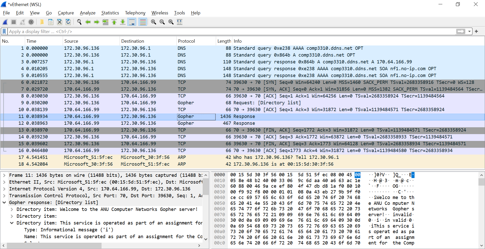

# COMP6331 Assign-2: Gopher Indexer

## Submission Details

- **Name:** Devansu Mahendra Yadav  
- **uID:** u7761531  

## Initial Gopher Server Response

<p align="center">
  
  <br>
  <em>Wireshark summary of the initial gopher server connection</em>
</p>

## Setting up and running the Gopher client

To run the Gopher client locally, you will need

1. [Golang](https://go.dev/) (Uses go version **`1.22.2`**)
2. Any supported environments such as **Linux**, **MacOS**, or **Windows**

```bash
cd gopher-indexer
go run main.go
```

Or

```bash
cd gopher-indexer
go build
./gopher-indexer
```

## Handling edge-cases

1. **Timeouts:**
Timeouts have been introduced for the following scenarios:

- Files taking too long to be sent by the server (eg: `/misc/tarpit`, `/misc/godot`) or
- Connecting to external servers which may not be accepting connections (eg: `comp3310.ddns.net:71`)
- Fetching server response for accessing directories which may be slow

- **Solution:** Introducing read timeouts on the connections using `(net.Conn).SetReadDeadline()` when reading responses from the server and connection timeouts for external servers that don't accept connections using `net.DialTimeout()`. The timeouts in both cases have been configured to be 5 seconds accounting for the file/response sizes, slow/unstable network conditions, and the gopher server load.

2. **File Size Exceeded:**
This Gopher client can handle large(or never ending) files by introducing a **Max File size limit** of **5 MB** (eg: `/misc/firehose`).

3. **Malformed Resources:**
This client handles malformed resources like improperly terminated text files (`/misc/malformed2`) by checking if the file is correctly terminated with CR-LF characters or not. It also handles malformed directories containing invalid references to resources (eg: `/misc/malformed1/file`).

4. **Cyclic References/Loops:**
This client crawls through the Gopher server efficiently and avoids getting stuck in a loop due to cyclic references by maintaining a map of directory paths it has already visited so far which can be seen in the `CrawlGopherServer()` function in `core/crawler.go`.

## Printing all the counts and listing server resources

Factors taken into consideration on how this Gopher client calculates all the counts and lists server resources:

1. **Number of Gopher directories on server:** Includes all valid directories starting from root directory crawled by the client (excluding directories causing cyclic references).
2. **The number, and a list of all simple text files (full path):** Includes all valid text files (excluding malformed, or files with issues like large file size, timeouts, or reference issues i.e. without host name, port no).
3. **The number, and a list of all binary (i.e. non-text) files (full path):** Includes all valid binary files (item types **4**,**5**, **6**, and **9**).
4. **Contents of smallest text file**: The client finds the smallest text file on the server to be `/misc/empty.txt`, hence prints out an empty line to STDOUT.
5. **Size of largest text file:** The client finds the largest text file in **bytes** out of all the valid text files (see pt 2).
6. **Size of the smallest and largest binary files:** The client finds the smallest and largest binary files in **bytes** out of all the valid binary files (see pt 3).
7. **Total no of unique invalid references:** Includes all the references with an "error" type (item type "3").
8. **List of external servers:** The client classifies a server as an external server if the host name is not **comp3310.ddns.net** or port no is not **70**. It also checks the status of the external servers if they are "up"/"down" based on whether these servers accept a connection or not. An external server has a "down" status if doesn't accept a connection indicated by a connection time out.
9. **List of references with issues/errors:** Includes malformed files (with improper termination), files with issues handled through timeouts and enforcing max file size limits. This list also includes files which are referenced incorrectly (without any host name and port no) within directories (such as `/misc/malformed1/file`).
